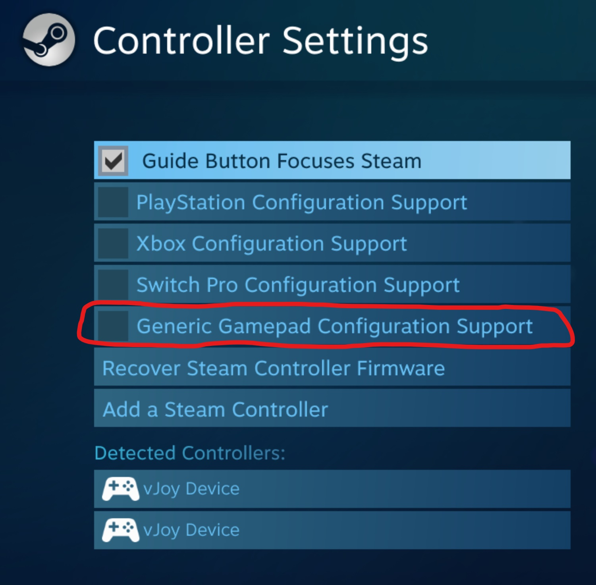
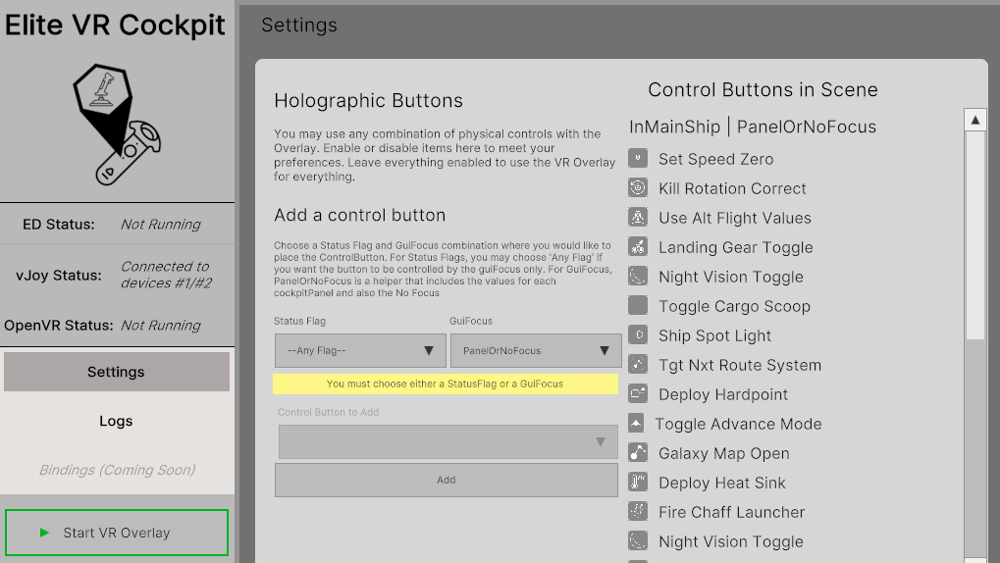

Getting Started
===============
If you're having problems after the initial setup. Read the [reminders](#10-reminders-before-you-get-started).


# 1. vJoy

Before running the Elite VR Cockpit you will need to install and configure [vJoy](https://sourceforge.net/projects/vjoystick/files/latest/download).

Open up `vJoy Configure` and make sure you have 2 vJoy Devices Configured:

#### vJoy device 1 (default enabled) ####
* Axis: make sure all axis are enabled
* Buttons: Set to 32. Technically, you only need 8, but setting this higher will make it future-proof
* POV/HAT switches: set to "4 Directions" and make sure there are 4 POVs configured
* Enable all Force Feedback effects

| vJoy Device 1                             |
| :---------------------------------------- |
|   |

#### vJoy device 2 ####
Enable this by clicking the "2" tab at the top and then clicking the "Add Device" button near the bottom of the window.
* Axis: make sure all axis are enabled (same as device 1)
* Buttons: Set to 32 (same as device 1)
* POV/HAT switch: *Leave unchanged*
* Do not enable any Force Feedback Effects
* Click Apply
* Click "enable vJoy" in the bottom-left corner, if it's not already clicked

| vJoy Device 2                            |
| :--------------------------------------- |
|  |


## 1a. Steam Big Picture

Steam Big Picture mode has special controller handling that can break vJoy. Open up Steam Big Picture's Controller Settings (accessable through the Big Picture mode button and accessible in VR from "Browse All" and navigating to the top) and ensure that the "Generic Gamepad Configuration Support" setting is **disabled**. If you do not, vJoy will not recieve any input from EVRC or any other program that uses vJoy.



## 1b. Steam VR
This must be running in order for you to launch the game in VR mode. You can download it for free in the Steam Store. "Elite VR Cockpit.exe" will launch Steam VR on  your computer for you, but it must be installed first.

# 2. Download and run

Download the latest version of the Elite VR Cockpit from the [Releases](https://github.com/boyestrous/elite-vr-cockpit/releases) and extract it wherever you want. There is no installer so "Elite VR Cockpit.exe" can be run directly.

# 3. Startup

0. If you have an Oculus, [do the workaround](OCULUS-WORKAROUND.md). You only have to do this once.
1. Turn on your VR hardware and launch Steam VR. If you don't have a native Steam VR device it can be launched separately from within your headset.
2. Start the app by clicking `Elite VR Cockpit.exe` on your desktop:
    - **On your desktop**: the Desktop Interface will open. This is where you can see the Status of Open VR, vJoy, and Elite Dangerous, as well as Logs from the overlay.
    

When ready, click the "Start VR Overlay" button in the lower-left corner, then put on your VR headset.

### Startup Message & Tracked Controllers
If everything worked correctly, you'll see this message inside SteamVR somewhere in front of your face. You may need to reset your seated position (instructions vary, depending on your headset).


You'll also see an overlay that sits on top of your VR controllers, one for each hand. The overlay should be tracked and move with your hands. When the game isn't running you _may_ still see your virtual hands or controllers, but these will disappear when Elite Dangerous starts running.


# 4. Configure your bindings
Elite Dangerous uses an XML file called _Custom.4.0.binds_ to manage the bindings that you've configured.
This file is located at **%AppData%/Local/Frontier Developments/Elite Dangerous/Options/Bindings**

At this time, the easiest thing to do is use a copy of the Custom.4.0.binds file from this project. Just save a backup of your old version and paste it into the game directory. You can then use the game interface to make edits to any other controls.

**Default bindings**
|                   	| Throttle Side        	| Joystick Side    	|
|-------------------	|----------------------	|------------------	|
| Trigger           	|                      	| Primary Fire     	|
| A/X Button        	| Toggle Flight Assist 	| Secondary Fire   	|
| B/Y Button        	|                      	| Deploy Heat Sink 	|
| POV - Up          	| Thrusters - Up       	| Select Target    	|
| POV - Down        	| Thrusters - Down     	| Next Target      	|
| POV - Left        	| Thrusters - Left     	| Prev Fire Group  	|
| POV - Right       	| Thrusters - Right    	| Next Fire Group  	|
| POV - Press/Click 	| Boost Throttle       	|                  	|

## 4a. More details on bindings - skip this section if you want the defaults
Vjoy is providing the interface for the overlay to the game, so you'll see vJoy references in the bindings file. Look at the Roll controls as an example. You'll see the Device='vjoy' and the Key begins with 'Joy':
```
  <RollAxisRaw>
		<Binding Device="vJoy" DeviceIndex="0" Key="Joy_XAxis" />
		<Inverted Value="0" />
		<Deadzone Value="0.00000000" />
  </RollAxisRaw>
```

You can apply this format to any control to set a binding to the virtual joystick/throttle/povs. Use the list below for reference:

**Virtual Joystick Controls**
  - Yaw (curling your wrist) - `Joy_RZAxis`
  - Pitch - `Joy_YAxis`
  - Roll - `Joy_XAxis`
  - Trigger - `Joy_1`
  - A Button - `Joy_2`
  - B Button - `Joy_3`
  - Hat/POV Controls - `Joy_POV#Up` / `Joy_POV#Down` / `Joy_POV#Left` / `Joy_POV#Right`
    - replace '#' with 1 or 2, based on your controller
  - Hat/POV Center Press - `Joy_4`

**Virtual Throttle Controls**
  - Throttle (increase/decrease axis) - `Joy_ZAxis`
  - Trigger - `Joy_8`
  - X Button - `Joy_7`
  - Y Button - `Joy_9`
  - Hat/POV Controls - `Joy_POV3Up` / `Joy_POV3Down` / `Joy_POV3Left` / `Joy_POV3Right`
  - Hat/POV Center Press - `Joy_6`


## 5. Meta Panel
When you start the game up (and possibly before), you'll see these three holographic buttons in front of you. These are always visible, no matter the state of the game.

1. Esc - proxy for the Esc Key on your keyboard
2. Padlock - toggles edit mode.
      - **When unlocked**: All holographic interfaces are move-able. This includes the positions of the joysticks and this menu itself
      - **When locked**: All buttons and joysticks are "live". Clicking the grab or trigger buttons will activate the associated actions
3. Menu - Activates Menu Mode. This is specifically for navigating game menus (like when you hit Esc). You will otherwise have to bind joystick actions to up/down/left/right to navigate. This is covered in more detail later.


## 5. Test it out!
**Do this in a training mission, rather than the live game**. Training missions have lots of options for different vehicle types and reduce the risk of having to rebuy your ship :)

### --- Test Edit Mode ---
Edit mode unlocks all of the holographic objects, so they can be repositioned inside VR.

1. Reach out at click the `Padlock` button on the Meta panel in front of you.
2. When you see the icon change to unlocked, you can reposition any element on the screen
3. Use the grab control on your VR controller to grasp the meta panel and move it. We recommend placing the meta panel down and to the right of your joystick, at arm's length. This way, it won't obstruct your view of the cockpit or any panels, but it's always in a consistent position.
4. Reposition your joystick and throttle (each represented by a holographic line) to a comfortable position.
5. Click the `Padlock` again to deactivate edit mode (notice the icon changes)


### --- Test Menu Mode ---
1. Reach out and click (usually trigger) on the `ESC` holographic button. The game's escape menu should open.
2. Once it's open, you'll notice you can't move around the menus with your controllers. *You need to enable menu mode first*. Do so now by clicking `Menu` underneath the padlock. Notice that the icon will change within ~1 second after you click it.

      #### **Menu Mode**
      In menu mode *all the other controls are disabled and your controller's buttons are just used to navigate the menu*:

      - Vive wands
        - Sliding your finger along the trackpad will navigate through menu items.
        - Pressing on the edge of the trackpad will navigate through menu items.
        - Pressing the center of the trackpad will select a menu item.
        - Pressing the application menu button will go back/go up/exit menus.
      - Valve Index Controllers
        - Moving the thumbstick will navigate through menu items.
        - Sliding your finger along the trackpad will navigate through menu items.
        - Pressing the A button will select a menu item.
        - Pressing the B button will go back/go up/exit menus.
        - Pressing the thumbstick will toggle nested menus open/closed.
      - Oculus Touch
        - Moving the thumbstick will navigate through menu items.
        - Pressing the A/X button will select a menu item.
        - Pressing the B/Y button will go back/go up/exit menus.
        - Pressing the thumbstick will toggle nested menus open/closed.
      - WMR
        - Moving the thumbstick will navigate through menu items.
        - Sliding your finger along the trackpad will navigate through menu items.
        - Pressing the application menu button will go back/go up/exit menus.
        - Pressing the thumbstick will toggle nested menus open/closed.

3. Navigate through the menu to ensure you can move up, down, left, right, and select/back
4. Once confirmed, press "Resume" to go back to the training mission
5. Press the `Menu` button again to deactivate Menu Mode (notice the icon changes back)

**Be sure to turn off menu mode when you leave the menu and want to control your ship. Menu mode is exclusively for controlling the main menu, pause menu, and in-game help screen.**

### --- Test Flight Controls ---
1. In the training mission, wait for the people to stop talking (controls won't work before that...)
2. Grasp the virtual joystick and make sure you can pitch, yaw, roll
3. Grasp the virtual throttle and make sure you can accelerate/decelerate

### --- Test UI Controls ---
In-cockpit UI panels (Internal, Chat, External, etc.) are activated by looking at them in VR. When you're looking at them, the virtual joystick/throttle controls will apply to those UI Panels instead of the flight controls.
1. Look at the panel on your right (the Role Panel).
2. Make sure you're grasping the virtual joystick, then use the thumbstick/trackpad to navigate up/down/left right in the panel
3. Use the `A` button to cycle to the next tab
4. Use the `Trigger` to select and `B` to go back
5. Look away from the panel (at any time) to go back to flying your ship. You do not need to re-grip the virtual joystick after exiting a panel.


# 6. Holographic buttons
While sitting in your VR cockpit (in a training session), take off your VR headset and look at the Desktop Interface. The "Controls" tab has options to add Holographic buttons to the VR interface.

To add a holographic button, choose a combination of _status flags_ + _gui focus_ values, then a list of relevant holographic buttons will populate in the dropdown list.

The [Status File API](https://elite-journal.readthedocs.io/en/latest/Status%20File/) is a little convoluted, but here is a list of common combinations of StatusFlags and GuiFocus values for placing holographic buttons.

**Remember**:
- Status Flags can have multiple active at the same time
- Gui Focus can only have one value at a time

| Mode             	| Status Flag + GuiFocus      	|
|------------------	|-----------------------------	|
| Main Ship        	| InMainShip + PanelOrNoFocus 	|
| SRV              	| InSRV + PanelOrNoFocus      	|
| Fighter          	| InFighter + PanelOrNoFocus  	|
| FSS Mode         	| InMainShip + FSSMode        	|
| Station Services 	| Any Flag + StationServices  	|
| Galaxy Map       	| Any Flag + GalaxyMap        	|
| System Map       	| Any Flag + SystemMap        	|
|                  	|                             	|

Once the buttons are in added via the desktop, you can move them around your virtual cockpit by activating `Edit Mode`, just like you moved your Meta Panel and Joystick/Throttle.
# Final Reminders before you get started
A couple of quick reminders before you get started.

## 1. You must "grab" the joystick or throttle before you can use any of the buttons on your VR controller

  - This includes POV/hats, triggers, primary, secondary, and alt buttons.
  - **Think of it like this:** If you hold your hand 1 foot over the top of your mouse and click down in mid-air, it doesn't do anything for your computer. Elite Dangerous is the same way. It's not watching for button clicks until you grab the joystick in VR, then your VR hand can physically reach all of the buttons...
  - This includes navigating UI Menus within your cockpit AND navigating the game menus. If you're looking to your left at the "external" screen, you still need to "grab" the joystick before you can use the POV/Hat to navigate through the screen.

### 2. Start small
Especially if you're new to the game, don't crowd your screen with a bunch of holographic buttons. Bind the controls listed in this guide and make sure you know how to do the following:

  1. Boost - bound to Throttle Primary
  2. Navigate the UI menus (while looking left/right at one of the holographic panels within your cockpit)
  3. Engage Frame Shift Drive - holographic button
  4. Deploy Landing Gear - holographic button

A large number of the other actions you'll need to know can be found by looking to your right, at the "Internal" UI screen.

### 3. Alternate Modes (SRV, Fighters, etc.)
SRVs and Fighters have different cockpits with different shapes and available controls so certain holographic buttons may not be relevant to your main ship. When you place holographic buttons using the Desktop Interface, they won't appear until your game is in the correct mode.

For example, SRV Controls won't appear until the StatusFlags contain "InSRV".

I recommend starting additional training missions to set up the SRV and Fighter holographic buttons.
