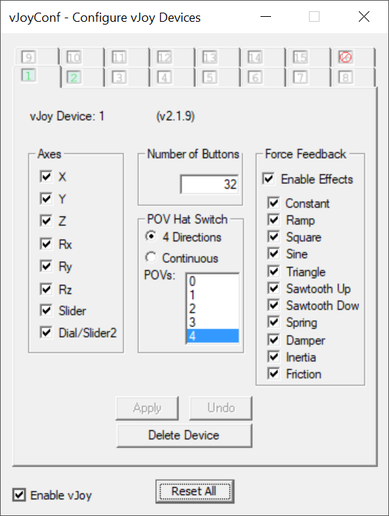
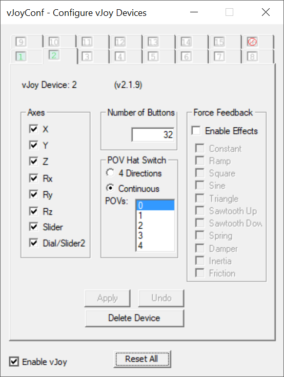
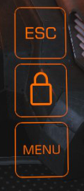
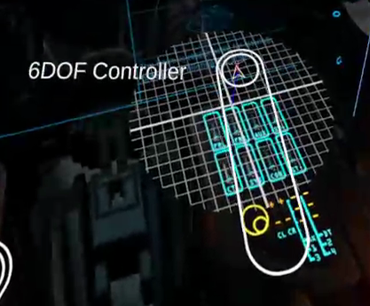
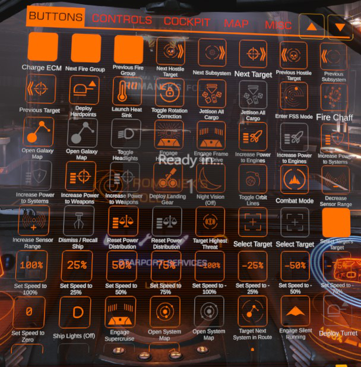
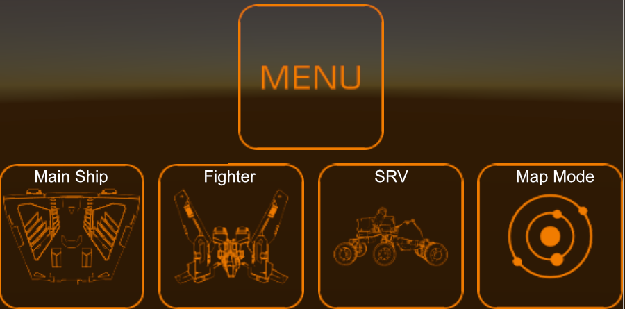
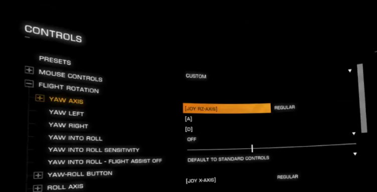
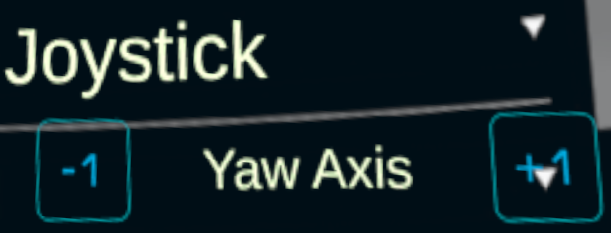

Getting Started
===============
If you're having problems after the initial setup. Read the [reminders](#10-reminders-before-you-get-started).

## 1. vJoy

Before running the Elite VR Cockpit you will need to install and configure [vJoy](https://sourceforge.net/projects/vjoystick/files/latest/download).

Open up `vJoy Configure` and make sure you have 2 vJoy Devices Configured:

#### vJoy device 1 (default enabled) ####
* Axis: make sure all axis are enabled
* Buttons: Set to 32. Technically, you only need 8, but setting this higher will make it future-proof
* POV/HAT switches: set to "4 Directions" and make sure there are 4 POVs configured
* Enable all Force Feedback effects

| vJoy Device 1                             |
| :---------------------------------------- |
|   |

#### vJoy device 2 ####
Enable this by clicking the "2" tab at the top and then clicking the "Add Device" button near the bottom of the window.
* Axis: make sure all axis are enabled (same as device 1)
* Buttons: Set to 32 (same as device 1)
* POV/HAT switch: *Leave unchanged*
* Do not enable any Force Feedback Effects
* Click Apply
* Click "enable vJoy" in the bottom-left corner, if it's not already clicked

| vJoy Device 2                            |
| :--------------------------------------- |
|  |

### 1a. Steam Big Picture

Steam Big Picture mode has special controller handling that can break vJoy. Open up Steam Big Picture's Controller Settings (accessable through the Big Picture mode button and accessible in VR from "Browse All" and navigating to the top) and ensure that the "Generic Gamepad Configuration Support" setting is **disabled**. If you do not, vJoy will not recieve any input from EVRC or any other program that uses vJoy.

### 1b. Steam VR
This must be running in order for you to launch the game in VR mode. You can download it for free in the Steam Store. "Elite VR Cockpit.exe" will launch Steam VR on  your computer for you, but it must be installed first.

## 2. Download and run

Download the latest version of the Elite VR Cockpit from the [Releases](https://github.com/dantman/elite-vr-cockpit/releases) and extract it wherever you want. There is no installer so "Elite VR Cockpit.exe" can be run directly.

## 3. Launch Programs

0. If you have an Oculus, [do the workaround](OCULUS-WORKAROUND.md)
1. Turn on your VR hardware and launch Steam VR. If you don't have a native Steam VR device it can be launched separately from within your headset.
2. Start the overlay by clicking `Elite VR Cockpit.exe` on your desktop:
    - In VR: you will see a message: "Elite Dangerous Not Started".
    - On your computer: the [Elite VR Cockpit Window](Images/ScreenshotDesktopUI.png) will open on your computer, where you can see the Status of Open VR, vJoy, and Elite Dangerous, as well as Logs from the overlay.
3. Start Elite Dangerous (make sure to select Steam VR if prompted).

If you started it correctly, you'll see a window in your VR headset that indicates Elite Dangerous is starting. You should also see the white outlines of the two joysticks on top of each hand controllers in VR. These may disappear briefly during the startup of the game..

| Left Hand: Throttle                                 | Right Hand: Joystick   |
| :---------------------------------------            | :---------------------------------------|
 | |

### 3a. Start a training mission
You will need to do some configuring, so start a training mission instead of jumping straight into the game.

Training missions offer a variety of ship types (Ship, Fighter, and SRVs), so you can configure your buttons based on each cockpit without risking a real ship in the real game.

If your seated position isn't in the right spot, hold down the reset seated position binding for a few seconds and the seated position will be reset.

- Vive wands: Hold the application menu buttons on both controllers
- Valve Index Controllers: Hold down down both Thumbsticks
- Oculus Touch controllers: press right menu button. Oculus menu will open, aim at "reset position" and follow instructions

Once the training mission has started, but before you start doing anything, take the steps below.

## 4. Main Interface
When you start the game up (and possibly before), you'll see these three holographic buttons in front of you:

1. Esc - proxy for the Esc Key on your keyboard
2. Padlock - toggles edit mode.
      - **When unlocked**: All holographic interfaces are move-able. This includes the positions of the joysticks and this menu itself
      - **When locked**: All buttons and joysticks are "live". Clicking the grab or trigger buttons will activate the associated actions
3. Menu - Activates Menu Mode. This is specifically for navigating game menus (like when you hit Esc). You will otherwise have to bind joystick actions to up/down/left/right to navigate. This is covered in more detail later.

## 5. Set your first bindings
First we're going to learn to navigate the menu system and start setting our custom bindings.

1. Reach out and click (usually trigger) on the ESC holographic button. The game's escape menu should open..
2. Once it's open, you'll notice you can't move around the menus with your controllers. *You need to enable menu mode first*. Do so now by clicking "Menu" underneath the padlock..

      #### **Menu Mode**
      In menu mode *all the other controls are disabled and your controller's buttons are just used to navigate the menu*:

      - Vive wands
        - Sliding your finger along the trackpad will navigate through menu items.
        - Pressing on the edge of the trackpad will navigate through menu items.
        - Pressing the center of the trackpad will select a menu item.
        - Pressing the application menu button will go back/go up/exit menus.
      - Valve Index Controllers
        - Moving the thumbstick will navigate through menu items.
        - Sliding your finger along the trackpad will navigate through menu items.
        - Pressing the A button will select a menu item.
        - Pressing the B button will go back/go up/exit menus.
        - Pressing the thumbstick will toggle nested menus open/closed.
      - Oculus Touch
        - Moving the thumbstick will navigate through menu items.
        - Pressing the A/X button will select a menu item.
        - Pressing the B/Y button will go back/go up/exit menus.
        - Pressing the thumbstick will toggle nested menus open/closed.
      - WMR
        - Moving the thumbstick will navigate through menu items.
        - Sliding your finger along the trackpad will navigate through menu items.
        - Pressing the application menu button will go back/go up/exit menus.
        - Pressing the thumbstick will toggle nested menus open/closed.

3. Navigate through the menu to Options > Controls..
4. At the top drop-down menu within the controls screen, set it to "generic joystick". This will give us a good starting point with a lot of defaults set for us.
5. Check your Axis Bindings. If any of these are not already set, see the instructions for [how to set axis bindings](#bind-an-axis).

    **Joystick and Throttle Axes**

    - `[JOY RZ-AXIS]` - yaw axis (joystick)
    - `[JOY X-AXIS]` - roll axis (joystick)
    - `[JOY Y-AXIS]` - pitch axis \[inverted\] (joystick)
    - `[JOY Z-AXIS]` - throttle axis

    |  	|  	|
    |--------------------------------------------	|--------------------------------------------	|

    **Thruster Axes (6DOF controller)**
    - `[JOY RX-AXIS]` - the lateral thruster axis
    - `[JOY RY-AXIS]` - the vertical thruster axis
    - `[JOY U-AXIS]` - the forward/backward thruster axis
    - Note: 6DOF controller only appears when flight assist is off or when imminently landing (landing gear)

    

6. Check your MAP and FSS axis bindings. [See instructions](#bind-an-axis) if these are wrong.

    - *Press the Map Holographic tab (instead of Cockpit) to set bindings for the galaxy map axis.*

      - `[JOY RY-AXIS]` - pitch axis
      - `[JOY RX-AXIS]` - yaw axis
      - `[JOY X-AXIS]` - translate x
      - `[JOY Y-AXIS]` - translate y
      - `[JOY Z-AXIS]` - translate z
      - `[JOY Rz-AXIS]` - zoom

    - *Press the Misc. tab to set bindings for FSS.*
      - `[JOY V-AXIS]` - FSS Radio
      - `[JOY RY-AXIS]` - FSS Pitch
      - `[JOY RX-AXIS]` - FSS Yaw

7. Check your SRV (Buggy) axis bindings.
    - *Use the Cockpit tab to set bindings for the SRV, if necessary.*
         - `[JOY X-AXIS]` Buggy Roll Axis: same as Joystick "Roll"
         - `[JOY Y-AXIS]` Steering Axis: same as Joystick "Pitch"
         - `[JOY Z-AXIS]` Buggy Throttle/Speed Axis: same as Throttle

**Be sure to turn off menu mode when you leave the menu and want to control your ship. Menu mode is exclusively for controlling the main menu, pause menu, and in-game help screen.**

## 6. Button bindings (Triggers, Primary, Secondary)

1. Go back to the "cockpit" tab in the edit menu..
2. [Follow the instructions](#bind-other-controller-buttons) to bind buttons..

    Personally I recommend the following bindings:

    * `Primary fire`: Primary on the Joystick side
    * `Secondary fire`: Secondary on the Joystick side
    * `Boost`: Secondary on the Throttle
    * `Chaff`: Primary on the Throttle

## 7. Joystick HAT/POV switches
On the joystick side only (usually grabbed with your right hand), there are up to 2 different POV/HAT switches available to be bound.

*There are no POV/HATs available on the throttle side, even if your controller has thumbsticks..*

The cockpit screen will list which POVs are available to you, based on your controller. Look at the screenshot below for an example with Vive Wands:
- POV1 up/down/left/right are mapped to edge presses and POV1 Button is mapped to a 'center press'
- POV2 directions can be accessed by sliding on the trackpad, but POV2 Button is **NOT** available
- For controllers that have thumbsticks instead of trackpads, a POV can be accessed by moving the thumbstick and pressing it in for the POV Button
- For controllers with smaller trackpads, a POV can be accessed by sliding on the trackpad and clicking anywhere for the POV Button

    

For binding, [follow the instructions](#bind-povhat-controls) You will use the two large images to emit the button presses for binding, just like you did with the other buttons and axes.

**You can bind the same button to different actions, depending on context**. Don't be afraid to bind your hat switches to UI controls, these bindings won't interfere with flight controls unless one of the cockpit panels is active.

## Recommended Settings:

| Control    	| Description    | [Vive Wands](Images/VRControllers.png)      	| [Valve Index](Images/VRControllers.png)     	| [Oculus Touch](Images/VRControllers.png)  |
|---------------------------------------------------------------------	|-----------------------------------------------------------------------------------------------------------------------------------------------------------------------------------------------------------------------------------------------------------------------------------------------	|----------------------------------------------------	|------------------------------------------------	|--------------------------------------------------------------------------------------------------------------------------------------------------------------------	|
| **Navigate UI** UI Up/Down/Left/Right                            	| Move up/down/left/right in menus or panels                                                                                                                                                                                                                                                 	| `POV1` `up/down/left/right` (edge press pad) 	| `POV1` `up/down/left/right` (thumbstick) 	|                                                           `POV1` `up/down/left/right` (thumbstick)                                                           	|
| **UI Panel Change** UI Next Panel Tab UI Previous Panel Tab   	| Switch tabs inside a UI panel or interface                                                                                                                                                                                                                                                 	|    `POV2 Left/Right`  (swipe on trackpad)    	|  `POV2 Left/Right`  (swipe on trackpad)  	| `Secondary` (A/X Button)  *Bind to **UI Next Panel only** for one direction  tab changes. It will roll back to the beginning when you  hit the end* 	|
| **UI Select**                                                       	| click on an option in a menu or interface                                                                                                                                                                                                                                                  	|               `Primary` (trigger)               	|           `Secondary` (A/X Button)          	|                                                                        `Primary` Trigger                                                                        	|
| **UI Back**                                                         	| back button in menu or interface                                                                                                                                                                                                                                                              	|     `Secondary` (application menu button - above trackpad)    	|              `Alt` (B/Y Button)             	|                                                                        `Alt` (B/Y Button)                                                                       	|
| **Select Target Ahead** Targeting section of ED Controls Menu 	| Targets the highlighted item on your HUD  *(We already bound this to UI up,  but you can bind the same action  in multiple contexts. When you're  looking at a UI screen in your  cockpit, it will move up, but when  you're just flying, it will  select target)* 	|            `POV1 Up` (edge press pad)           	|            `POV1 Up` (thumbstick)           	|                                                                      `POV1 Up` (thumbstick)                                                                     	|

 

## Return to the game
We're done binding buttons for now. Get back to the game.

1. Lock edits by clicking the padlock. The cockpit screen will disappear.
2. Use menu mode, if necessary, to save your configurations and resume the game.

## 8. Holographic buttons
While sitting in your VR cockpit (in a training session), re-open Edit Mode by touching the padlock with the circle on your controller and pull the trigger to interact with it.

When edit mode is unlocked, the [Edit Panel](Images/ScreenshotMenu.png) will appear once again. You will be able to use the grip button to reposition any holographic element on the screen, including the list of buttons itself.

The buttons menu is the first tab that we saw when we unlocked edit mode earlier. If unlocking the padlock doesn't automatically show this screen, click the "buttons" tab now.

  - 

## Each of these buttons can be moved to any part of your holographic interface.
1. Place the circle of your controller and pull the trigger, which will put the button in the "staging bar" at the bottom
    - Note: solid buttons without an icon work fine, they just don't have an icon
2. Grasp the button and move it where you want it
    - I recommend placing 3-4 buttons in the top-right of your view, near the handles (that way you're not obstructing your view)
3. I recommend the following buttons (at a minimum):
    - `Engage Frame Shift Drive` - somewhere to the left of your throttle
    - `Deploy Landing Gear` - upper-right of your cockpit, near the handle (see picture below)
    - `Ship Lights` - upper right, near the Landing Gear (see picture below)

## Buttons can be removed by moving them close to the trash icon for a few seconds.

## Elite Dangerous must have a keyboard binding for an action, in order for a holographic button to work
Holographic buttons with missing bindings will show up in red. You may add any keyboard binding for the related control in the game's control panel to make the button work.. You may add any keyboard binding for the related control in the game's control panel to make the button work.

### Troubleshooting holographic buttons
This overlay does not currently have mappings for every button/keyboard. If a holographic button or control isn't working, do the following:

1. Look at the [Elite VR Cockpit Window](Images/ScreenshotDesktopUI.png) and see if there is an error: `Could not send keypress Key_xxxx, did not understand one or more of the keys`.

    - If you see this message:
    1.  [open a new issue](https://github.com/dantman/elite-vr-cockpit/issues) in Github
    2. include the full text of the error from the log
    3. also include your `Custom.3.0.binds` file (usually located at `C:\Users\YOURUSERNAME\AppData\Local\Frontier Developments\Elite Dangerous\Options\Bindings`)

## 9. Troubleshooting your bindings
If you find any bugs in the interface, try restarting Elite or the Cockpit overlay. Controls should be reloaded as you make changes, but sometimes a reset will resolve any outstanding issues.

## 10. Reminders before you get started
A couple of quick reminders before you get started.

### 1. You must "grab" the joystick or throttle before you can use any of the buttons on your VR controller

  - This includes POV/hats, triggers, primary, secondary, and alt buttons..
  - **Think of it like this:** If you hold your hand 1 foot over the top of your mouse and click down in mid-air, it doesn't do anything for your computer. Elite Dangerous is the same way. It's not watching for button clicks until you grab the joystick in VR, then your VR hand can physically reach all of the buttons...
  - This includes navigating UI Menus within your cockpit AND navigating the game menus. If you're looking to your left at the "external" screen, you still need to "grab" the joystick before you can use the POV/Hat to navigate through the screen..

### 2. Start small
Especially if you're new to the game, don't crowd your screen with a bunch of holographic buttons that you don't know how you'll use. Bind the controls listed in this guide and make sure you know how to do the following:

  1. Boost - bound to Throttle Primary
  2. Chaff - bound to Throttle Secondary
  3. Navigate the UI menus (if you look left/right within your cockpit)
  4. Engage Frame Shift Drive - holographic button
  5. Deploy Landing Gear - holographic button

A large number of the other actions you'll need to know can be found by looking to your right, at the "Internal" UI screen.

### 3. Alternate Modes (SRV, Fighters, etc.)
SRVs and Fighters have different cockpits with different shapes and available controls so certain holographic buttons may not be relevant to your main ship. Multiple cockpits can be configured and saved using the ship mode buttons (underneath the main buttons on the Main Panel).

I recommend starting additional training missions to set up the SRV and Fighter holographic buttons.

# Appendix
### How to bind controller actions
You cannot bind actions as you would with a physical joystick. It is best if you bind the actions using the special elite-vr-cockpit controls.

#### Setup
- Start from the cockpit view within a training mission (that way you don't risk losing your ship while messing with configurations)
- **Menu mode**: off
- **Padlock**: locked

#### Open menus
1. Open the game menu (press Esc)
2. Enable Menu Mode (press Menu)
3. Navigate to Options > Controls
4. Scroll down until you see the axis you want to bind.
  
5. Click your primary button to start a new binding. The screen will say "press a key to bind..."

6. Enter Edit Mode by clicking the holographic padlock icon (underneath Esc). The menu below will appear directly in front of you.

    - **IGNORE THE BUTTONS**
    - Pay attention to the tabs (at the top, circled in blue)
    - click "Cockpit" to see the axis bindings

       

7. **Remember**: while in Edit Mode, you can move any holographic item, including this large menu. I recommend moving this to the right, so you can see it alongside the controls screen
    - In the screen below, you can see the Game Controls Menu (background) with the Edit Cockpit holographic menu on top (might be orange or another color if you [[changed your HUD color](https://forums.frontier.co.uk/threads/no2o-the-definitive-list-of-1-7-2-2-compatible-hud-colour-color-configs-please-add-yours.259311/)](https://forums.frontier.co.uk/threads/no2o-the-definitive-list-of-1-7-2-2-compatible-hud-colour-color-configs-please-add-yours.259311/))
    - The holographic cockpit menu is two sides, the left side is everything for your left hand (throttle) and the right side is everything for your right hand (joystick)
    - We already set the game to wait for an input, so **all we have to do is click the holographic proxy for the control we want to bind**
      - [Binding Ship Axes](#bind-an-axis)
      - [Binding POV/HAT controls](#bind-povhat-controls)
      - [Binding other Buttons](#bind-other-controller-buttons)

  

#### Bind an Axis
1. [follow the steps](#how-to-bind-controller-actions) to open the controls screen and enter edit mode for the cockpit
2. Click on the axis you want to bind, so the game screen says "press a key to bind..."
3. In the holographic cockpit screen, press either the `-1` or `+1` button on either side of the axis (Yaw axis pictured)
  NOTE: there are other mappable axes

  

#### Bind POV/HAT controls
1. [follow the steps](#how-to-bind-controller-actions) to open the controls screen and enter edit mode for the cockpit
2. Click on the action you want to bind, so the game screen says "press a key to bind..."
3. In the holographic cockpit screen, click the POV/HAT direction you want to bind
  - **common area of confusion**: You will see two POV/HAT switches on the right side. BOTH of these switches are for your right controller. On the Index and WMR controllers one is for a small trackpad and the other is for a joystick. On the Vive wands one is used for clicks and the other is used for swipes. On controllers like Oculus Touch that only have a single axis only the first POV is available.
  - *There is no POV/HAT config for the throttle side*

#### Bind other Controller Buttons
1. [follow the steps](#how-to-bind-controller-actions) to open the controls screen and enter edit mode for the cockpit
2. Click on the action you want to bind, so the game screen says "press a key to bind..."
3. In the holographic cockpit screen, there are only 5 options to choose for the throttle and joystick, even if your controller has more buttons.
    - Primary - usually the trigger (one on each control)
    - Secondary - usually `A` or `X` (one for each control)
    - Alt (joystick only) - usually `B` or `Y` -- *not available on all controllers*
4. **To Bind**: hover your vr controller over the "Primary/Secondary/Alt" spot in the holographic menu and click (just like the other ones). Resist temptation to try to press the corresponding button in your controller...
<<<<<<< HEAD
=======

