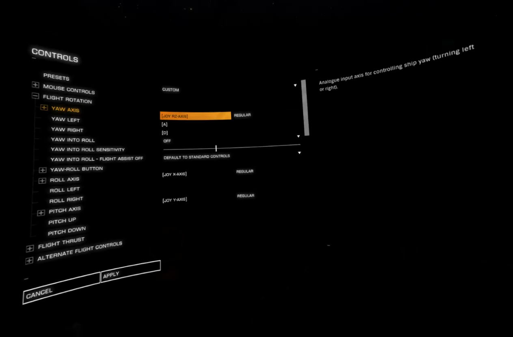
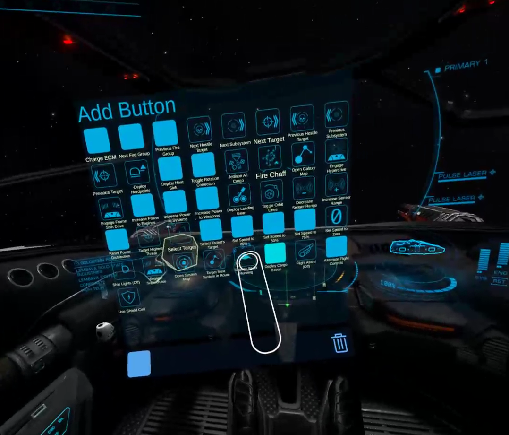

Getting Started
===============

## 1. vJoy

Before running the Elite VR Cockpit you will need to install and configure [vJoy](http://vjoystick.sourceforge.net/site/).

Open up `vJoy Configure` and make sure you have the following configured:

* vJoy Devices: In addition to the default vJoy Device 1 you must also enable vJoy Device 2
* Axis: To simplify things make sure all axis are enabled
* Buttons (device 1): For now 8 buttons are enough, but you can future proof your setup by setting it to 32
* POV/HAT switches (device 1): Configure POVs to "4 Directions" and make sure there are 4 POVs configured

| vJoy Device 1                             | vJoy Device 2                            |
| :---------------------------------------- | :--------------------------------------- |
|   |  |

### 1a. Steam Big Picture

Steam Big Picture mode has special controller handling that can break vJoy. Open up Steam Big Picture's Controller Settings (accessable through the Big Picture mode button and accessible in VR from "Browse All" and navigating to the top) and ensure that the "Generic Gamepad Configuration Support" setting is **disabled**. If you do not, vJoy will not recieve any input from EVRC or any other program that uses vJoy.

## 2. Download and run

Download the latest version of the Elite VR Cockpit from the [Releases](https://github.com/dantman/elite-vr-cockpit/releases) and extract it wherever you want. There is no installer so "Elite VR Cockpit.exe" can be run directly.

## 3. Running

Startup `Elite VR Cockpit.exe` and start Elite Dangerous. I recommend starting up the training missions to start configuring bindings and setting up buttons instead of jumping straight into the game. You can quickly switch between the Ship, Fighter, and SRVs by choosing different training missions which will let you setup buttons in the positions you want relative to the cockpit, without worrying about loosing your ship while working on that.

If your seated position isn't in the right spot, hold down the reset seated position binding for a few seconds and the seated position will be reset.

- Vive wands: Hold the application menu buttons on both controllers
- Valve Index Controllers: Hold down down both Thumbsticks

## 4. Menus

When you start the game up, you'll probably want to navigate the game menus. Below the Edit Mode lock button is a Menu button you can press to enter menu mode.

In menu mode all the other controls are disabled and your controller's buttons are just used to navigate the menu:

- Vive wands
  - Sliding your finger along the trackpad will navigate through menu items.
  - Pressing on the edge of the trackpad will navigate through menu items.
  - Pressing the center of the trackpad will select a menu item.
  - Pressing the application menu button will go back/go up/exit menus.
- Valve Index Controllers
  - Moving the joystick will navigate through menu items.
  - Sliding your finger along the trackpad will navigate through menu items.
  - Pressing the A button will select a menu item.
  - Pressing the B button will go back/go up/exit menus.
  - Pressing the joystick will toggle nested menus open/closed.
- Oculus Touch
  - Moving the joystick will navigate through menu items.
  - Pressing the A/X button will select a menu item.
  - Pressing the B/Y button will go back/go up/exit menus.
  - Pressing the joystick will toggle nested menus open/closed.
- WMR
  - Moving the joystick will navigate through menu items.
  - Sliding your finger along the trackpad will navigate through menu items.
  - Pressing the application menu button will go back/go up/exit menus.
  - Pressing the joystick will toggle nested menus open/closed.

Be sure to turn off menu mode when you leave the menu and want to control your ship. Menu mode is exclusively for controlling the main menu, pause menu, and in-game help screen.

## 5. Axis bindings

In order for the throttle, joystick, 6dof controller, and map to work you will need to bind their axis in the controls

Unlock edit mode while in menu mode to display the cockpit panel. This panel has a set of buttons to send virtual throttle/joystick axis inputs and joystick button inputs to the game. This will allow you to bind controls for the joystick and throttle even when they are not present. The Map and Misc tabs can be used to bind additions bindings for the galaxy map and other controls.

Make sure you have the following bound. Only pitch should be inverted, all others should be set to regular.

- `[JOY RZ-AXIS]` on yaw axis
- `[JOY X-AXIS]` on roll axis
- `[JOY Y-AXIS]` on pitch axis
- `[JOY Z-AXIS]` on throttle axis
- `[JOY RX-AXIS]` on the lateral thruster axis
- `[JOY RY-AXIS]` on the vertical thruster axis
- `[JOY U-AXIS]` on the forward/backward thruster axis

  

You will need to press the Map tab and set bindings for the galaxy map axis.

Make sure the following galaxy map axis are bound, none of the axis should be inverted:

- `[JOY RY-AXIS]` on pitch axis
- `[JOY RZ-AXIS]` on yaw axis
- `[JOY X-AXIS]` on translate x
- `[JOY Y-AXIS]` on translate y
- `[JOY Z-AXIS]` on translate z
- `[JOY V-AXIS]` on zoom

You will need to press the Misc tab and set bindings for the FSS axis.

## 6. Joystick and throttle button bindings

The trigger and application menu are bound to separate joystick buttons. You can bind these to any control option you want by selecting a control option grabbing onto the throttle or joystick and pulling the trigger/pressing the application menu button.

Personally I recommend the following bindings:

* Primary fire: Primary on the Joystick
* Secondary fire: Secondary on the Joystick
* Boost: Secondary on the Throttle
* Chaff: Primary on the Throttle

## 7. Joystick HAT/POV switches

When grabbing the cockpit joystick the trackpad/thumbstick on the controller you grab the joystick with is bound to 1-2 separate HOTAS HAT/POV switches and buttons which can be bound to Elite Dangerous controls.

The "Cockpit" tab of the edit panel has information telling you what joystick/thumbstick interactions are bound to which POV directions/buttons and which POV directions/buttons are not available on your controller. This tab also has buttons in the shape of a large POVs for the 2 potential POVs, which can be used to emit the POV/button presses to bind them to Elite Dangerous controls.

- Joystick movements are bound to POV directions
- Joystick presses are bound to a POV button
- Sliding your finger on a trackpad is bound to a POV direction
- On large trackpads (Vive wands) pressing edges of the trackpad are bound to directions on a separate POV
- A POV button is bound to pressing small trackpads or pressing the center of a large trackpad

I recommend taking advantage of this to bind UI up/down/left/right to one of the POV switches and left/right on the other to UI previous/next category. It's up to you whether you want to slide your finger to navigate and press the edges to switch categories. or press in a direction to navigate and slide your finger to change categories. On single POV controllers like Oculus Touch you may need to repurpose one of the other buttons on your controller to "next category" in order to navigate through the ship panel's tabs.

Either way I also recommend binding a POV center button or A button (Secondary) to UI select and the Vive's application menu (Secondary) or B button (Alt) to UI back.

Elite Dangerous still allows you to bind a button bound to a UI input to other functions. So even when binding the joystick's hat switches to UI actions you can still bind the hat switches to other controls that will be used when not looking at a holo panel.

For instance you may want to bind a direction to cycle fire groups, another to select a target you are looking at, and other targeting controls. Or bind power management controls if you are doing combat with fast PIP changes.

## 8. Holographic buttons

In front of you there should be an "Edit Mode" button with a padlock icon. Touch it with the circle on your controller and pull the trigger to interact with it and unlock edit mode.

When edit mode is unlocked you will be able to use the grip button to reposition the edit button, joystick/throttle, buttons, and any edit mode panel.

The "Add Button" panel that shows up in front of you can be used to spawn new holographic buttons.

Buttons can be removed by moving them close to the trash icon and leaving them there for a few seconds.

## 9. Holographic button bindings

You do not need to setup a specific button layout in order to use ship function buttons. Any keyboard binding you have configured for a control will be read from your custom bindings and the button will press that button combo.

Note that some keys do not currently have mappings; this can usually by fixed by sharing any warning you get or your `Custom.3.0.binds`.

However this does mean that keyboard bindings must be setup for any system function button that you wish to use. If a control is unconfigured or only has non-keyboard bindings such as gamepad bindings it will not be usable. If Elite VR Cockpit cannot find keyboard bindings for a button it will appear red when you spawn it.

Some of the buttons have a default key binding they will emit when red. If you don't have a specific key you wish to bind a control to you can select the relevant binding in your controls menu and press the red button to give it the default binding if the button has one. Otherwise, open up your controls menu and assign a keyboard binding to any of the controls you want to have red holographic buttons for.

Be sure to restart either Elite Dangerous or the overlay after you update your bindings. We don't currently detect changes to bindings while the game is running.
