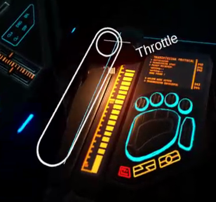
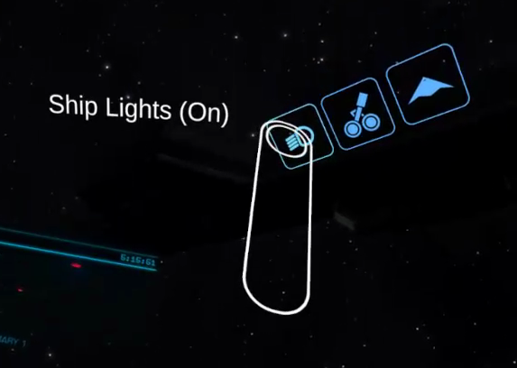

Elite VR Cockpit (Beta)
================

**Elite VR Cockpit** is a SteamVR overlay for Elite Dangerous. The overlay is currently in an [beta stage](#known-limitations-of-beta-version) but is sufficient to play

* [Download](https://github.com/boyestrous/elite-vr-cockpit/releases)
* [Getting Started](GETTING-STARTED.md)
* [Report a bug](https://github.com/boyestrous/elite-vr-cockpit/issues)
* [Oculus Rift SteamVR Workaround](OCULUS-WORKAROUND.md)

  

# Features

## Virtual throttle and joystick

A virtual throttle and virtual joystick are located in the location of the in-game's throttle and joystick.

- The controls can be grabbed with the grip button to interact with them.
- The joystick is VTOL VR inspired. Only rotation of the controller is tracked. So you can grab the joystick then move your hand and rest the base of your controller on your leg to get a stable base to move around the joystick. No need to float your hand in mid-air.
- When edit mode is unlocked you can grab with the grip button and reposition the throttle and joystick.
- The trigger and application menu button are bound to different joystick buttons depending on whether they are grabbing the joystick or throttle.
- There are separate throttle/joystick positions for ships and for SRVs due to the different cockpit layouts.
  - The overlay automatically switches layouts when you deploy/dock your SRV or Fighter

### HAT/POV switch
Similar to physical HOTAS controls, there are directional "HAT"/"POV" controls that can be used while you're gripping the virtual throttle or virtual joystick. There are _up to_ 2 POVs per hand, but most controllers just have a single POV.

If you have a thumbstick then thumbstick directions will be bound to directions on POV1 and thumbstick click will be bound to the POV1 center button.

If you have a small trackpad then swipes on that trackpad will be bound to directions on POV1 and trackpad press will be bound to the POV1 center button.

However if you have a large trackpad like on the Vive wands this trackpad may be bound to 2 POVs. Swipes will be for POV2 and directional Presses will be for POV1. Center press will always be for the POV1 center button.

- Pressing the trackpad in the center of the trackpad will be bound to POV1 center press.
- Pressing the edges of the trackpad will be bound to directional presses on POV1.
- Dragging your finger along the trackpad will be bound to directional presses of POV2 at regular intervals.

## Holographic buttons

The overlay provides a variety of ship functions as holographic buttons.

* *(Some button icons have not been gathered yet)*
* Buttons can be activated by pulling the trigger while interacting with them.
* When edit mode is unlocked, buttons can be grabbed by holding down the grip button (the edit mode button itself included) and repositioned wherever you like. *(positions will be saved when edit mode is re-locked)*
* Your in-game bindings will be read and the button will output whatever key-combination that function is bound to.
  * A binding must be present for the holographic button to work properly. *any* binding will do... Buttons for ship functions that you have not bound to a keyboard key yet will appear red.
* Most toggle functions have tooltips that will automatically change when ship status changes. (e.g. The landing gear button will switch between "Deploy landing gear" and "Retract landing gear" depending on whether the gear is up or down)
* New holographic buttons can be spawned and deleted from the Desktop Interface

## Elite Dangerous integration

The overlay is integrated with the status API provided by the game.
- The controls will change based on your in-game status and focus
  - Maps, Station Services, and FSS Mode don't show the Virtual Joystick/Throttle
  - SRV, Fighter, and Main Ship have separate sets of holographic buttons and a separate joystick/throttle, so you can save different placements for each view.
- You will be warned when ED not focused and will not receive input from the virtual joystick, throttle, or holographic buttons.

Journal API is not used. We recommend using EDDI for additional timely information.

# Known Limitations of Beta Version
* *Some keyboard keys currently do not have mappings* - We occasionally find keyboard buttons that aren't recognized. Buttons like the tilda (~), backtick (`), and apostrophe (') will occasionally throw strange characters. If you see this error, submit an issue and we'll add it.
* On Foot controls aren't supported _yet_. Use your keyboard/mouse.
* Holographic buttons will not respond to custom cockpit color schemes. Enjoy the default Orange!

# License

See the [LICENSE.md](LICENSE.md) file for license information.
